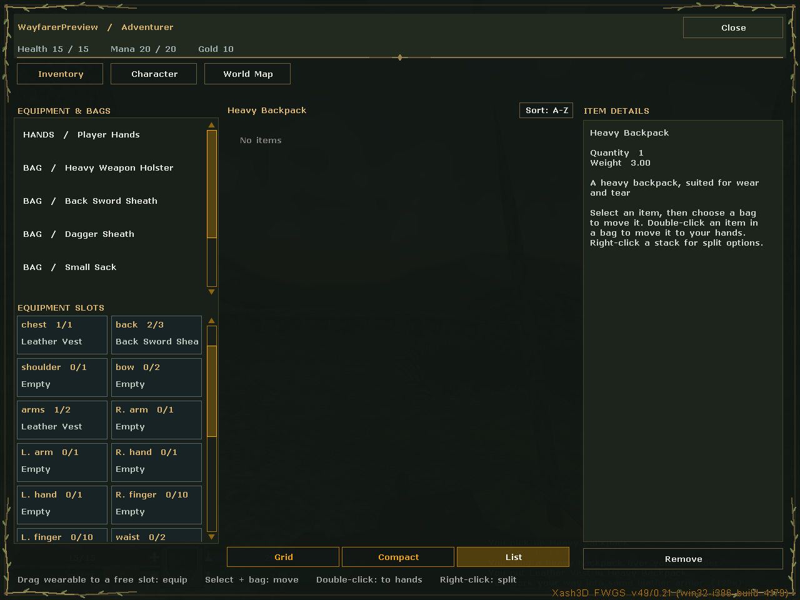
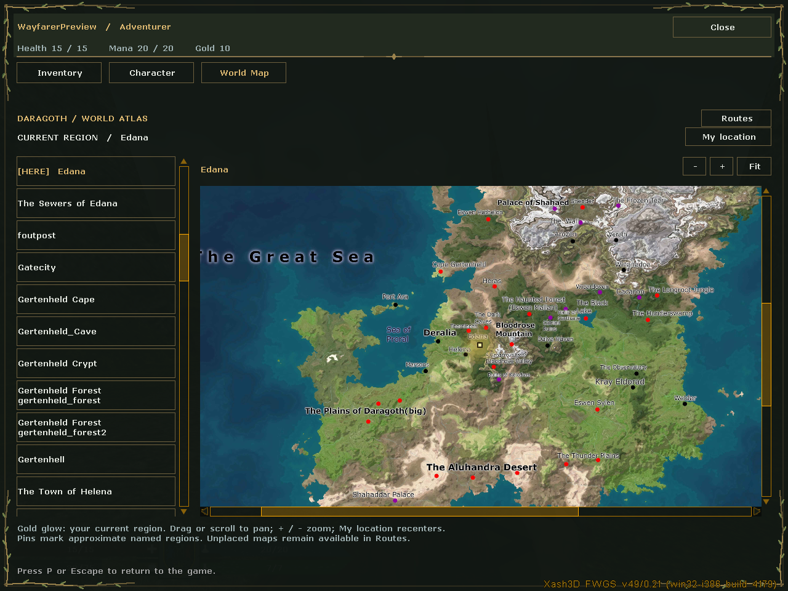

# Master Xash3ord Re-rebirth

A Windows community build of **Master Sword: Rebirth**, using a PrimeXT SDK
integration and Xash3D FWGS, with private FN character persistence and Dungeon
Master controls.

## Download and play

Get the [UI Debug update](https://github.com/ExoAI-S/Master-Xash3ord-Re-rebirth/releases/tag/v2026.09.12-ui-debug).
Download **MSR-Unified-Debug-Complete-2026-09-12.zip** and extract it completely
into a writable folder. It is one complete ZIP containing one current game.

Open **MSR-Launcher.exe** or **Play-MSR.cmd** inside the extracted MSR folder.
Use **Create-Desktop-Shortcuts.cmd** for the MSR, realm-join and Dungeon Master
shortcuts. **Play-Realm-One.cmd** and **Play-Realm-Two.cmd** join the shared
Internet realms. Their host and tunnels must be online. **Play local** creates
your own FN service and two local realms with a separate set of saves.

Press **P** to toggle the tabbed **Inventory**, **Character** and **World Map**
menu. Armor can be dragged from hands or bags to compatible equipment slots on
an updated server. The world atlas highlights the player's current named
region, with zoom, centering and a separate transition view. See
[MENU-GUIDE.md](MENU-GUIDE.md) and [START-HERE.md](START-HERE.md).





## This update

- New inventory layout, character sheet and fantasy ivy/bronze menu decoration.
- Authored equipment capacities and guarded armor drag-and-drop.
- Daragoth artwork with a pulsing current-region marker and map transitions.
- One base level and experience bar for each weapon skill; magic schools and
  Parry remain separate. Existing weapon-script aliases keep working.
- Realistic regular and rusty shortswords, with the original player model.
- A single launcher and game package, retaining Dungeon Master controls and
  both Internet realm join helpers.
- FN character requests now run in local Create Game sessions as well as
  dedicated realms.

The client and server are **Debug** builds with matching PDB symbols. See
[UI-UPDATE-VALIDATION.md](Release/UI-UPDATE-VALIDATION.md) for completed checks
and their limits. The optional native MScript event prototype is disabled;
gameplay still uses the MScript interpreter. Broader character-model and
weapon experiments are separate from these completed replacements.

Keep your old release and private save/profile backups before upgrading.
[The previous DM Debug release](https://github.com/ExoAI-S/Master-Xash3ord-Re-rebirth/releases/tag/v2026.09.12-dm-debug)
remains available for recovery. Restoring only old DLLs does not restore the
old distribution of weapon subskills after a migrated save has been written.
See [Recovery/README.md](Recovery/README.md).

GitHub's automatic **Source code** ZIP is a developer snapshot. Use the named
release ZIP for the executable game, maps, models, sounds and bundled runtime.
The release also contains its source and editable shortsword artwork.
PrimeXT SDK features are available for further development; their source or
material files alone do not establish that every renderer feature is active.

## Source layout

| Path | Purpose |
| --- | --- |
| `Full-Source/msr_source` | Modified MSR client, server, MScript runtime and build input libraries |
| `Full-Source/msr_port` | PrimeXT integration targets, encounter scripts, material tools and art inputs |
| `Full-Source` | Parent PrimeXT SDK and vendored dependency snapshots |
| `Engine-Source/Xash3D` | Xash3D FWGS source and dependency snapshots |
| `Launcher` | Native Windows launcher source and Python host/diagnostic helpers |
| `Portable-Package/FN` | Private FN service, protocol implementation and tests |
| `Stable-Base/FN` | Historical recovery service source |
| `Portable-Package/source`, `Stable-Base/source` | Earlier standalone patches, source notes and notices |
| `Packaging-Work` | Regression checks and verified FN save-transfer support |
| `SOURCE-INVENTORY.json` | Byte hashes linking extracted source files to the original release ZIP |

The source checkout retains Full-Source; the unified ZIP calls this folder
Source. Compare files using that prefix mapping. Historical baseline manifests
refer to the earlier release; Release/UI-UPDATE-VALIDATION.md describes this update. Runtime configuration and shaders are retained, but
game binaries, maps, models, sounds, debug outputs and bundled language runtimes
are in the complete release. Imported third-party source retains its upstream
documentation; older upstream build instructions may describe a different
layout or the original project rather than this integration.

## Build the game DLLs on Windows

Install Visual Studio Build Tools with the C++ desktop workload, CMake 3.24 or
newer, Ninja, Git and Python. Use an **x86 Native Tools Command Prompt** and run
the following from the repository root. The shipped game and its libraries are
32-bit; a 64-bit game DLL cannot replace them.

The vendored vcpkg directory is a source snapshot without its Git history.
Use a separate vcpkg checkout at the baseline recorded in the SDK manifest for
versioned dependency resolution:

```bat
git clone https://github.com/microsoft/vcpkg.git .dependencies\vcpkg
git -C .dependencies\vcpkg checkout 962e5e39f8a25f42522f51fffc574e05a3efd26b
call .dependencies\vcpkg\bootstrap-vcpkg.bat -disableMetrics
cmake -S Full-Source -B build\msr-debug -G Ninja -DCMAKE_BUILD_TYPE=Debug -DCMAKE_TOOLCHAIN_FILE="%CD%/.dependencies/vcpkg/scripts/buildsystems/vcpkg.cmake" -DVCPKG_TARGET_TRIPLET=x86-windows -DBUILD_CLIENT=OFF -DBUILD_SERVER=OFF -DBUILD_UTILS=OFF -DBUILD_GAME_LAUNCHER=OFF -DBUILD_MSR_PORT=ON -DMSR_NATIVE_EVENT_PILOT=OFF -DENABLE_PHYSX=OFF -DGAMEDIR=msr
cmake --build build\msr-debug --target msr_client msr_server --parallel
```

The configure step downloads build dependencies. Outputs are in
`build/msr-debug/Debug/msr/bin`. With the game and its servers stopped, copy
`client.dll` and `client.pdb` to an extracted release's
`Portable-Package/game/msr/cl_dlls`, and `ms.dll` and `ms.pdb` to its
`Portable-Package/game/msr/dlls`. Keep matching PDB symbols for crash diagnosis. Preserve the previous release
and raw save backups separately when testing changes.

The release's `scripts.pak` remains required for gameplay. It is supplied in
the full package, along with the authored Edana script additions in source.
To use the optional `msr_verify_scripts` build target, first copy that pack to
`Full-Source/game_dir/msr/scripts.pak`. Do not replace it with PrimeXT material
files from the separate `scripts` directory.

The package's original `Full-Source/msr_port/Build-MSR-Port.cmd` entry point is
also preserved. Its default configuration is Release; `-Configuration Debug`
selects Debug. It expects a usable vendored vcpkg installation or the original
dependency cache. The explicit commands above are intended for a fresh source
checkout.

## Launcher, FN and checks

`Launcher/Source/Build-Launcher.cmd` compiles the native Debug launcher using
Windows' .NET Framework C# compiler. Copy the resulting `MSR-Launcher.exe` and
PDB into an extracted release to run it with the included runtime files.
See [the launcher source notes](Launcher/Source/README.md).

FN uses Python's standard library and binds to loopback by default. Its
[protocol notes](Portable-Package/PROTOCOL.md) explain compatibility and the
separate private profile identities. The complete package's launcher creates
host settings and player identities on first use; existing users' profiles,
character databases, passwords and tunnel credentials are not included.

From the repository root, these isolated checks use temporary state or compile
small native fixtures instead of launching the public realms:

```bat
python Portable-Package\FN\test_fn.py
python Packaging-Work\test_transfer_fn_state.py
python Packaging-Work\run_script_effect_tests.py
python Packaging-Work\run_script_return_lifetime_tests.py
```

The last two commands require the x86 MSVC developer prompt. Other preserved
packaging tests may expect a complete extracted release or the original
`friend-support` staging layout; their source describes those requirements.
The repository extraction was verified against the release archive; a full
fresh-checkout game/engine rebuild is separate from the release's recorded
Debug build and playtest evidence.

For an engine rebuild, see the Windows Waf instructions in
[Engine-Source/Xash3D/README.md](Engine-Source/Xash3D/README.md) and the exact
engine revision/attachment patch details in
[Portable-Package/source/BUILD.md](Portable-Package/source/BUILD.md).
The engine is a separate build from the PrimeXT/MSR game DLLs.

## Credits and licensing

This is a community integration, with upstream work from
[MSRevive/MasterSwordRebirth](https://github.com/MSRevive/MasterSwordRebirth),
[SNMetamorph/PrimeXT](https://github.com/SNMetamorph/PrimeXT),
[FWGS/xash3d-fwgs](https://github.com/FWGS/xash3d-fwgs), Valve and their
respective contributors. It is not an official FN service or an official
release from those upstream projects.

There is no single license applied to the entire bundle. MSR/Valve SDK terms,
Xash3D GPL notices, the private FN service's scoped MIT license, and individual
dependency/asset notices remain separate. See
[THIRD-PARTY-NOTICES.md](THIRD-PARTY-NOTICES.md). Source availability does not
relicense game art, audio or other third-party content.
